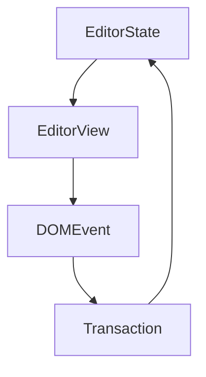

The built-in CSS will be replaced after update / reinstall, DO NOT MODIFY THEM.

Refer https://support.typora.io/Add-Custom-CSS/ when you want to modify those CSS.
Refer https://support.typora.io/About-Themes/ if you want to create / install new themes. 

